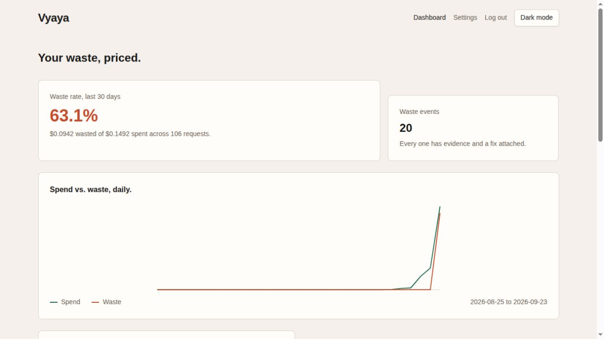
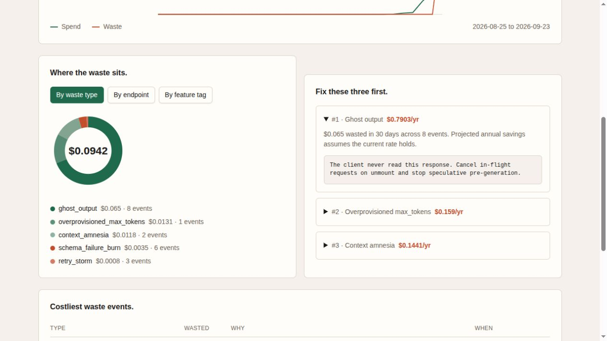
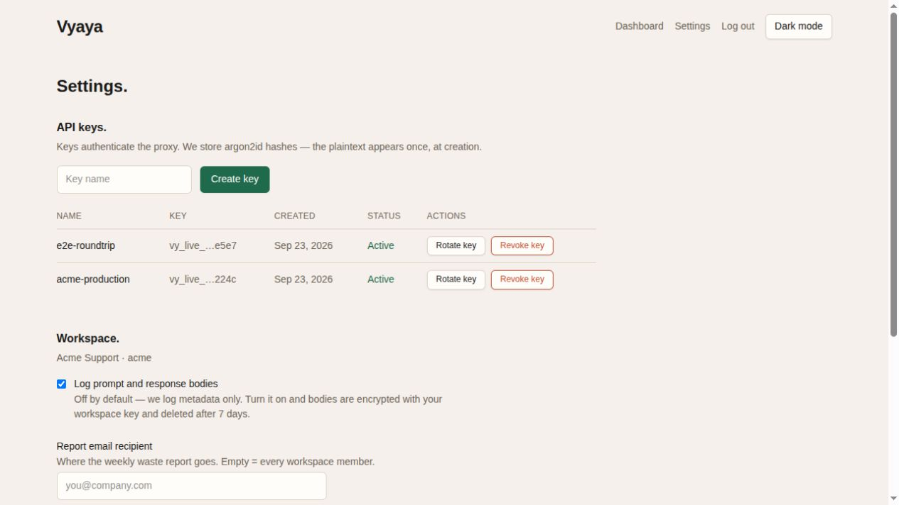
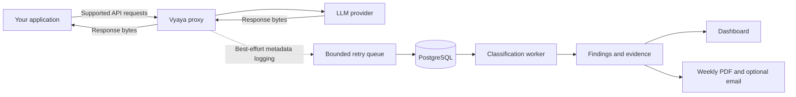

<div align="center">

# Vyaya

### See what your LLM spend is actually buying.

Find repeated calls, discarded responses, and rejected completions.<br />
Turn request-level evidence into a prioritized engineering fix list.

**Self-hosted · OpenAI-compatible · Metadata-first · Five waste detectors**

[Product tour](#product-tour) · [Features](#features) · [Quick start](#quick-start) · [Documentation](#documentation) · [Roadmap](#release-status-and-roadmap)

</div>



*Actual application screenshot with synthetic demo traffic. Dollar figures and the displayed waste rate illustrate the interface; they aren't customer results or guaranteed savings. The current dashboard includes a capacity estimate in its total; see [measurement limits](#understand-the-numbers).*

## Make the next optimization obvious.

An LLM bill tells you how much you spent. Finding the requests behind that bill takes more work: retries that repeat the same prompt, output your application never uses, or a completion rejected by your own schema.

Vyaya captures supported API traffic, applies five rule-based detectors, and puts the evidence beside the cost and suggested fix. It's built for platform teams, backend engineers, and founders who need an actionable explanation of growing LLM spend.

- **Find the pattern.** Group findings by waste type, endpoint, or feature tag.
- **Inspect the evidence.** Connect a finding to the requests and detector version that produced it.
- **Prioritize the work.** Review the top fixes and their projected impact.
- **Track the trend.** Follow daily spend and share a weekly PDF with your team.

## Product tour

### 1. Connect an existing application.

Point a supported SDK at Vyaya's proxy and attach a workspace API key. The onboarding flow provides TypeScript and Python snippets and a test-request action. Start with the included mock provider when evaluating locally.

### 2. See where spend is being lost.

The dashboard brings together a 30-day overview, daily spend versus detected waste, a breakdown by type, endpoint, or feature tag, and the costliest findings. Expand a recommended fix to inspect the suggested action.



*Synthetic demo findings. Projected annual savings assume the observed rate continues.*

### 3. Manage the workspace and share the findings.

Create, rotate, and revoke API keys; configure workspace settings; and download generated weekly reports. Viewer accounts get read-only controls.



*Local demo workspace. Only masked key suffixes are visible. [Screenshot provenance](docs/images/README.md).*

## Five patterns worth investigating

| Detector | What it flags | What you can investigate |
| --- | --- | --- |
| **Ghost output** | Successful responses explicitly marked unconsumed, after a minimum age. | Unused generations, abandoned workflows, or missing consumption handling. |
| **Retry storms** | Repeated identical prompts within a window, followed by a successful attempt. | Retry policy, backoff, and application idempotency. |
| **Schema failure burn** | Successful completions that fail the requested response schema. | Schema constraints, prompt instructions, and validation handling. |
| **Context amnesia** | Repeated prompt context across consecutive turns in a session. | Session construction and redundant input. Requires opt-in prompt capture. |
| **Overprovisioned max tokens** | Sustained low completion usage relative to the requested limit. | Output limits and capacity configuration. Its dollar value is an estimate, not proof of a provider charge. |

Detectors run without additional model calls. Findings include request references, structured evidence, a detector version, and a suggested fix. Thresholds are configurable. See the [feature reference](docs/FEATURES.md) for rules and defaults.

## Features

| Capability | What ships today |
| --- | --- |
| **Streaming proxy** | Buffered and SSE Chat Completions, plus embeddings; response bytes pass through unchanged. |
| **Request accounting** | Model, endpoint, latency, token counts, prompt hash, retry metadata, session ID, feature tag, and server-calculated cost. |
| **Failure visibility** | Upstream stream failures and client disconnects are logged separately; partial attempts retain usage when reported by the provider. |
| **Waste analysis** | Five versioned heuristic detectors, configurable thresholds, evidence, and fix suggestions. |
| **Dashboard** | Spend and waste trends, breakdowns, top fixes, and a findings table; light and dark themes. |
| **Onboarding** | Key creation, SDK connection examples, and a proxied test request; development-only classifier trigger. |
| **Weekly reports** | PDF generation, download from settings, and optional email delivery. |
| **API-key lifecycle** | Workspace keys, one-time plaintext display, argon2id hashing, rotation, and revocation. |
| **Workspace access** | DeskId sign-in and admin, operator, and viewer roles; PostgreSQL RLS and explicit workspace query filters. |
| **Privacy controls** | Metadata-only capture by default; opt-in encrypted bodies and scheduled retention jobs. |
| **Operations** | Separate proxy, web, and worker processes; bounded logging queue, job locks, health endpoints, and optional tracing. |
| **Developer tooling** | Docker Compose, deterministic mock provider and identity services, seeded examples, SQL migrations, and an end-to-end verification script. |

## How it works



The proxy observes traffic. Detection runs asynchronously and doesn't rewrite prompts, reroute models, or enforce optimization decisions. Logging and telemetry failures are designed to fail open; authentication, rate limits, and upstream failures still affect requests. Queue delivery is bounded and best-effort, so monitor dropped-log metrics.

## Quick start

Use a disposable local environment for your first evaluation. The default Compose setup uses mock identity and a mock LLM provider, so you can explore without a provider API key.

**Requirements:** Node.js 22.12 or newer, pnpm 10.17.1, Docker with Compose 2.24 or newer, and OpenSSL for generating secrets. Run the following from the repository root.

```bash
cp .env.example .env
pnpm install --frozen-lockfile

# Generate two different values and put them in .env:
# SESSION_COOKIE_SECRET and MASTER_ENCRYPTION_KEY.
openssl rand -hex 32
openssl rand -hex 32
```

Keep `AUTH_MODE=dev` for this local demo. After filling the secrets:

```bash
COMPOSE_PROFILES=mock-deskid docker compose up --build -d

# Build the host-side migration and seed commands.
pnpm -r build
pnpm --filter @vyaya/db migrate
pnpm --filter @vyaya/db seed

# Classify the synthetic sample traffic.
docker compose exec worker node dist/index.js --job classify --once
```

Open [localhost:3000](http://localhost:3000) and use the development sign-in flow. The seed creates sample workspaces and prints demo keys once. A newly provisioned login may have an empty workspace; use onboarding to create a key and send traffic for that workspace. Keep printed keys out of screenshots and shared logs.

For real provider traffic, configure the upstream URL and credential on the proxy. In Compose, the upstream override is `COMPOSE_UPSTREAM_BASE_URL`. Production identity uses `AUTH_MODE=deskid`. Follow the [deployment guide](docs/DEPLOY.md) for origins, service roles, migrations, and secrets.

### Connect a TypeScript application

Use this in a server-side application with the `openai` SDK installed. Set `VYAYA_API_KEY` to the key created in your workspace.

```ts
import OpenAI from "openai";

const vyayaKey = process.env.VYAYA_API_KEY;
if (!vyayaKey) throw new Error("VYAYA_API_KEY is required.");

const client = new OpenAI({
  baseURL: "http://localhost:8787/v1",
  apiKey: "proxy-managed", // The proxy holds the upstream credential.
  defaultHeaders: { "X-Vyaya-Key": vyayaKey },
});

const response = await client.chat.completions.create({
  model: "gpt-4o-mini",
  messages: [{ role: "user", content: "Summarize this support request." }],
});
console.log(response.choices[0]?.message.content);
```

<details>
<summary><strong>Python example.</strong></summary>

```python
import os
from openai import OpenAI

client = OpenAI(
    base_url="http://localhost:8787/v1",
    api_key="proxy-managed",
    default_headers={"X-Vyaya-Key": os.environ["VYAYA_API_KEY"]},
)

response = client.chat.completions.create(
    model="gpt-4o-mini",
    messages=[{"role": "user", "content": "Summarize this support request."}],
)
print(response.choices[0].message.content)
```

</details>

Add `X-Vyaya-Tag` for feature attribution, `X-Vyaya-Session` for session grouping, and retry headers where your application has that context. Consumption detection requires an explicit signal; Vyaya can't infer whether a human read an answer. See the [proxy header reference](apps/proxy/README.md).

**Supported API surface:** `/v1/chat/completions` and `/v1/embeddings`. Responses API support and broader provider compatibility are on the backlog.

## Privacy and deployment

- **Your infrastructure.** Run the proxy, database, dashboard, and worker in your own environment.
- **Metadata first.** Prompt and response body capture is disabled by default. Context-amnesia detection needs prompt content and stays inactive without it.
- **Encrypted body capture.** Opt-in bodies use AES-256-GCM with a per-workspace data key wrapped by the deployment master key.
- **Retention.** Defaults are seven days for bodies and 400 days for request metadata; daily aggregates are retained. The worker applies retention rules.
- **Workspace boundaries.** RLS, explicit tenant filters, hashed API keys, and role checks are implemented. Membership and session revocation hardening remains a release blocker.

Read the [architecture](docs/ARCHITECTURE.md), [environment reference](docs/ENV.md), and [retention runbook](ops/DATA_RETENTION.md) before deploying.

## Understand the numbers

Vyaya's findings are engineering signals built from captured traffic and pricing assumptions. They need interpretation:

- **Coverage matters.** Model pricing currently covers a limited set of exact names. Unknown models can appear at zero cost, so totals may understate spend when pricing coverage is incomplete.
- **Capacity isn't a bill.** The max-token detector applies a reservation-overhead estimate. The current dashboard includes it in waste totals; interpret that portion as an optimization estimate rather than a verified provider charge.
- **Timing matters.** Batch boundaries, aging responses, and late-arriving logs can affect current detector results.
- **Projections aren't realized savings.** Annualized fix values extrapolate observed periods. They aren't a guarantee or an invoice reconciliation.

See [metric definitions](docs/ANALYTICS.md) and [planned improvements](#release-status-and-roadmap).

## Release status and roadmap

**Current release: v0.1.0, under active development.** The product is suitable for local evaluation and controlled pilots. Production readiness is still being established; this README doesn't claim completed security certification, an SLA, or verified customer savings.

| Focus | Planned improvements |
| --- | --- |
| **Measurement and access** | Consistent classification across batches, aging and late-arrival handling, membership reconciliation, broader pricing coverage, and separate capacity estimates. |
| **Service reliability** | Durable metering, email retries, lower proxy latency, bounded authentication caching, broader API support, and readiness checks. |
| **Deployment and operations** | Reproducible builds, automated verification, staging integration checks, and backup/restore validation. |

The [pricing document](docs/PRICING.md) describes proposed packaging and test-mode billing; it isn't a live purchase offer.

## Develop and verify

```bash
pnpm build
pnpm typecheck
pnpm test

# Full local round trip without Docker.
# Also requires curl, Python 3, and gcc/make if Redis must be built.
scripts/e2e-local.sh
```

The end-to-end script exercises authentication, key creation, a proxied request, database logging, classification, and dashboard APIs. It tears down its processes after verification. See [test documentation](docs/TESTS.md) for suites and prerequisites. The proxy latency test currently exceeds its target; latency improvements are included in the [roadmap](#release-status-and-roadmap).

<details>
<summary><strong>Repository layout.</strong></summary>

```text
apps/web           Next.js dashboard and backend-for-frontend
apps/proxy         Hono streaming proxy
apps/worker        Classification, reports, and retention jobs
apps/mock-openai   Deterministic local provider
apps/mock-deskid   Development identity issuer
packages/core      Detectors, pricing, encryption, JWT, logging
packages/db        Drizzle schema, migrations, RLS, seed data
packages/config    Validated service configuration
docs               Product and engineering references
ops                Deployment and operations runbooks
```

</details>

## Optional integrations

| Integration | Purpose | Availability |
| --- | --- | --- |
| **DeskId** | Authentication and organization claims; optional grants reconciliation. | Production identity integration; authorization reconciliation hardening is open. |
| **Resend** | Weekly report emails. | Requires configuration; durable retry work is open. |
| **ClickHouse** | Optional request-log sink. | Opt-in; validate your complete analytics path before switching from PostgreSQL. |
| **KubeMind** | Route upstream traffic through a KubeMind router. | Opt-in. |
| **Sentinel / OpenTelemetry** | Proxy and worker tracing. | Opt-in. |
| **Stripe** | Usage metering integration. | Test mode; durable outbox delivery is unfinished. No live checkout or customer portal. |

See [integration contracts](docs/INTEGRATIONS.md) and the [production roadmap](#release-status-and-roadmap).

## Documentation

| I want to… | Start here |
| --- | --- |
| Evaluate every feature and its limits. | [Feature reference](docs/FEATURES.md) |
| Run or deploy Vyaya. | [Deployment](docs/DEPLOY.md) · [Environment](docs/ENV.md) |
| Integrate with the HTTP API. | [API reference](docs/API.md) · [OpenAPI schema](docs/OPENAPI.yaml) |
| Understand the accounting. | [Analytics](docs/ANALYTICS.md) · [Architecture](docs/ARCHITECTURE.md) |
| Configure optional services. | [Integrations](docs/INTEGRATIONS.md) |
| Review release blockers. | [Roadmap](#release-status-and-roadmap) |
| Explore the rest of the project. | [Documentation index](docs/README.md) |

For a useful pilot, start with one non-sensitive workload, tag its requests, inspect the findings against your own logs, and validate an optimization before expanding traffic. That's the path from an interesting chart to an engineering decision you can defend.

## Licensing

Vyaya is licensed under the [MIT License](LICENSE).
